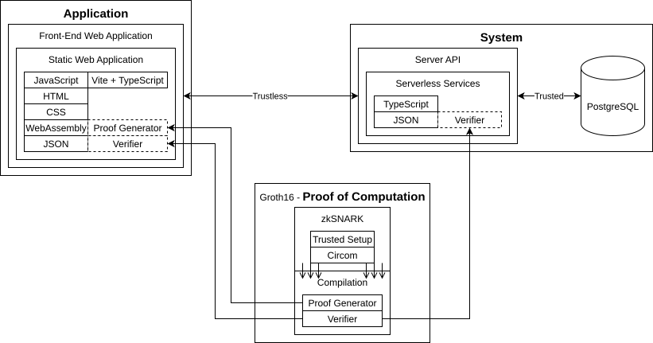

# Projekt

Celem projektu było stworzenie aplikacji i systemu służących do tworzenia głosowań które oferowały by anonimowość i jak najmniejszy brak konieczności zaufania do dowolnej strony. Aplikacja jest interfejsem użytkownika dzięki któremu może on w wygodny sposób korzystać z systemu.

# Elementy Projektu

## Schemat Poglądowy


## Aplikacja

### Tworzenie kluczy publicznych

Użytkownik może tworzyć parę klucza prywatnego i klucza publicznego.

### Tworzenie głosowań

Użytkownik może tworzyć głosowania składające się z:
- Opisu,
- Zbioru kluczy publicznych uczestników.

### Weryfikacja głosowania

Użytkownik może zweryfikować informacje dotyczące danego głosowania identyfikowalnego za pomocą deterministycznego identyfikatora głosowania.

### Oddanie głosów

Użytkownik może stworzyć i oddać głos na dowolną opcję. Głos jest weryfikowany i rejestrowany przez ***System***.

Z głosu wynika:
- ***Identyfikator głosowania (deterministyczny)***
- Opcja - Wartość na jaką użytkownik zagłosował.
- ***Nullifikator*** - Unikalna wartość dla połączenia (**nie jawnego**) uczestnika tego głosowania i ***(deterministycznego) identyfikatora tego głosowania***.
- **Dowód przynależności do głosowania i powiązania informacji powyższych, dzięki któremu można zweryfikować czy głos nie został utworzony w nieuczciwy sposób.**.

### Weryfikacja wyników głosowania

Wyniki każdego głosowania można pobrać z ***Systemu*** i je zweryfikować.

## System

Ze względu na ułatwienie zrozumienia oraz uczenienie systemu taniego w implementacji system ten daję jedynie częściowe (nie pełne) gwarancje braku konieczności zaufania.

### Stworzenie głosowania

Każdy użytkownik może stworzyć głosowanie składające się z:
- Opisu,
- Zbioru kluczy publicznych uczestników.

Każde głosowanie jest ***identyfikowalne w sposób deterministyczny***.

### Zagłosowanie

Każdy użytkownik ma prawo oddać głos dla danego głosowania. Głos ten jest rejestrowany tylko jeśli przejdzie weryfikacje pod kątem kryptografi, będzie odnosił się do zarejestrowanego głosowania dla którego nie będzie istniał zarejestrowany głos o takim samym identyfikatorze co podany głos.

Głos jest identyfikowalny poprzez połączenie ***nullifikatora*** oraz ***(deterministycznego) identyfikatora głosu***.

### Udostępnienie danych

Każdy użytkownik ma prawo odczytać z systemu opis, członków, i wyniki głosowań poprzez ***(deterministyczny) identyfikator głosu***.

# Wymagania Techniczne

## Kryptografia - Systyem Głosowania

Wykorzystywny system powinien umożliwiać:
- Tworzenie par kluczy prywatnych i publicznych.
- Tworzenie zbioru kluczy publicznych reprezentujących uczestników głosowania.
- Tworzenie głosu dowodzącego że głos pochodzi od jednego z twórcy klucza publicznego wykorzystanego w danym zbiorze kluczy publicznych. Jednocześnie głos musi wiązać opcję na jaką owy głosujący głosuje, opis głosowania, oraz jedyny możliwy nullifikator jaki może głosujący wygenerować. Nullifikator powinien być stały i nie zmienny dla danego głosującego i opisu głosowania (Nie powinien zależeć od oddanego głosu).
    - Głos powinien być weryfikowalny przez dowolną stronę dla danego opisu głosowania i zbioru kluczy publicznych. 

## Kryptografia - Deterministyczny Identyfikator Głosowań

Każde głosowanie powinno być identyfikowalne krótkim skrótem. Skrót ten powinien wiązać opis i członków głosowania co gwarantowało by nie podrabialność głosowania.

# Działanie

## Aktorzy

- ***Uczestnicy*** - Użytkownicy którzy są właścicielami swoich kluczy publicznych oraz głosującymy w anonimowym głosowaniu.
- ***Organizator*** - Użytkownik który tworzy głosowanie ze zbioru kluczy publicznych jakie otrzymał od uczestników.

## Scenariusz

1. ***Uczestnicy*** tworzą i zapamiętują swoje pary kluczy publicznych i prywatnych. 
    
    
2. ***Uczestnicy*** przekazują organizatorowi swoje klucze publiczne.
    
    
3. ***Organizator*** definiuje z danym opisem i z zbiorem kluczy publicznych jakie otrzymał od uczestników.
4. ***Organizator*** tworzy głosowania i otrzymuje adres głosowania.
    
    
5. ***Organizator*** przekazuje adres głosowania uczestnikom.
6. ***Uczestnicy*** zapoznają się z opisem głosowania wskazanym pod adresem wysłanym przez organizatora.
    
    
7. ***Uczestnicy*** oddają głosy.
    
    
8. Każdy użytkownik jest w stanie ustalić opis i wyniki głosowania wskazanego pod danym adresem.
    
    

# Realizacja

Projekt udało nam się w pełni zrealizować.

## Schemat realizacji



## Kryptografia - Systyem Głosowania

Do realizacji wymagań z tej sekcji wykorzystaliśmy technologie zkSNARK pozwalającą udowodnić znajomość wartości zachowujących między sobą odpowiednie relacje które traktujemy jako możliwość udowodnienia przeprowadzenia poprawnego przetwarzania danych z ich częściowym ujawnieniem. (tak zwane dowody zerowej wiedzy).
- ***Głos*** jest tak naprawde dowodem zerowej więdzy w którym to użytkownik udowadnia poprzez wprowadzone `merkle_leafs`, `privateKey`, `publicKey_index`, `invitation` że jego klucz publiczny pochodzi ze zbioru o odpowiednim korzeniu Merkle, reprezentującym zbiór kluczy publicznych członków głosowania. Dowód dodatkowo wiąże identyfikator głosowania, wartość głosu i dodatkowo udstępnia unikatowy ***nullifikator***.

Ponieważ zkSNARK'i nie pozwalają wprowadzać parametrów o zmiennej długości takich jak niczym nieograniczone łańcuchy znaków, to też głos w dowodzie reprezentuje skrót wartości którą chcemy powiązać a sama wartość jest oddzielna od tego dowodu.

### Wymagania

- [circom](https://github.com/iden3/circom) - Narzędzie do czytelnego definiowania układów.
- [snarkjs](https://github.com/iden3/snarkjs) - Narzędzie do zamiany układu R1CS na podprogramy i zestaw kluczy zkSNARK.
- [Powers of Tau](https://github.com/privacy-ethereum/perpetualpowersoftau)/ppot_0080_14.ptau (`sha256sum: 3ca1149e9349b22b0ee0649399cfb787677129b7b1189d1899fc0d615d9583db`) - specjalny zestaw tych samych sekretów o wielu wariantach potęg. ***Nie jest konieczne korzystanie z tego samego zestawu. Ceremonię potęg Tau można samemu wygenerować dla celów testowych, lecz nie zaleca się takich praktyk dla celów produkcyjnych***.

### Kompilacja

ZkSNARK'i wymagają wczesnej kompilacji dlatego wpierw przeprowadzamy konwersje układu na format R1CS przy pomocy narzędzia **circom** (w którym to przejrzyściej opisujemy nasz układ). Następnie przy pomocy narzędzia **snarkjs** zamieniamy nasz układ na zestaw programów i kluczy służących do szybszej generacji i weryfikacji dowodów.

```sh
circom vote.circom --r1cs --sym --wasm
snarkjs groth16 setup vote.r1cs ppot_0080_14.ptau vote_prover.zkey
snarkjs zkey export verificationkey vote_prover.zkey vote_verifier.json
```

W projekcie korzystamy z symoblicznych powiązań z których korzystają ***Aplikacja*** i ***System*** do użycia tych zamych skompilowanych pod programów. Skompilowane programy należy umieścić w `/circuits/public_deploy`.

Warto zaznaczyć że `/circuits/public_deploy` znajdują się już skompilowane zkSNARK'i na potrzeby produkcyjne.

## Aplikacja

Aplikacja realizujemy poprzez prostą aplikacje web'ową.

### Wymagania

- [npm](https://www.npmjs.com/) - służący do zainstalowania paczek i uruchomienia aplikacji.

### Uruchomienie

W terminalu należy wpisać:

```sh
cd vite-project
npm install
npm run dev
```

Aplikacje będzie dostępna lokalnie pod adresem `http://localhost:5173/`.

## System

System realizujemy poprzez serwer API i baze danych PostreSQL. Serwer API jest napisany języku TypeScript w formie niezależnych od siebie funkcji zwracających odpowiedzi na zapytania, wygodna pod środowiska serverless.

### Wymagania

- [npm](https://www.npmjs.com/) - służący do zainstalowania paczek i uruchomienia aplikacji.
- Baza danych PostgreSQL.

### Baza Danych

Tebele do bazy danych zdefiniowane są w skrypcie `/db/setup.sql`. Skrypt ten należy uruchomić w kontekście danej bazy danych.

### Uruchomienie Serwera API

Na początku należy zainstalować odpowiednie paczki.

```sh
cd server
npm install
```

Następnie należy skonfigurować plik `/server/.env` tak żeby zawierała potrzebne informacje do połączenia się z bazą danych i dla innych aspektów technicznych:

```env
# Recommended for most uses
DATABASE_URL=

# For uses requiring a connection without pgbouncer
DATABASE_URL_UNPOOLED=

# Parameters for constructing your own connection string
PGHOST=
PGHOST_UNPOOLED=
PGUSER=
PGDATABASE=
PGPASSWORD=

# Parameters for Vercel Postgres Templates
POSTGRES_URL=
POSTGRES_URL_NON_POOLING=
POSTGRES_USER=
POSTGRES_HOST=
POSTGRES_PASSWORD=
POSTGRES_DATABASE=
POSTGRES_URL_NO_SSL=
POSTGRES_PRISMA_URL=

# Cron job secret key
CRON_SECRET=
```

W naszej realizacji Serwer API dodatkowo usuwa głosowania starsze niż 3 dni.

Finalnie uruchomić jedną z poniższych komend. Rekomendujemy użycie pierwszej gdyż jak najlepiej odzwierciedla docelowe środowisko na którym chcieliśmy uruchomić nasz system. 

```sh
#????????????????????????????????   # Recommended!!!
# Testing with Vercel
npx vercel dev --yes
#::::::::::::::::::::::::::::::::
# Vercel-like tester
npx tsx test_server.js
```

Aplikacje będzie dostępna lokalnie pod adresem `http://localhost:3000`.


## Hosting Aplikacji

Wszystkie komponenty zostały dostosowane tak żeby były przyjazne dla prostych i tanich usług hostingowych. Cały projekt jest hostowany w serwisie Vercel i NeonDB w ramach darmowych usług.

### Aplikacja
- **Aplikacja**: [https://reptillian-zkvoting.vercel.app/](https://reptillian-zkvoting.vercel.app/)

### System
- **Serwer API**: [https://reptillian-zkvoting-api.vercel.app/](https://reptillian-zkvoting-api.vercel.app/) 
- **Baza danych**: *Pozostaje nie widoczna dla nie uprawnionych.*

> ***Nie gwarantujemy że wszystkie części projektu będą hostowane. Hosting jest darmowy i nie ma żadnego prywatnego wsparcia do dalszej pracy ani utrzymania.***

## Testy

A idź pan w h...