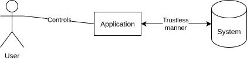
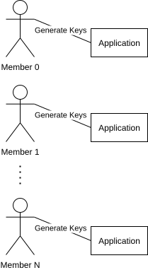
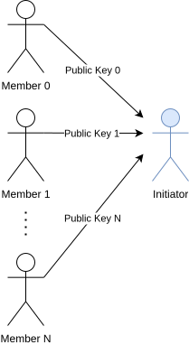
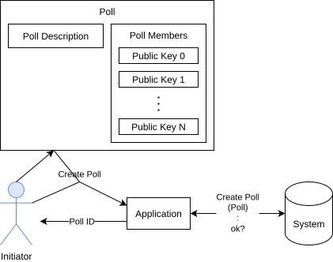
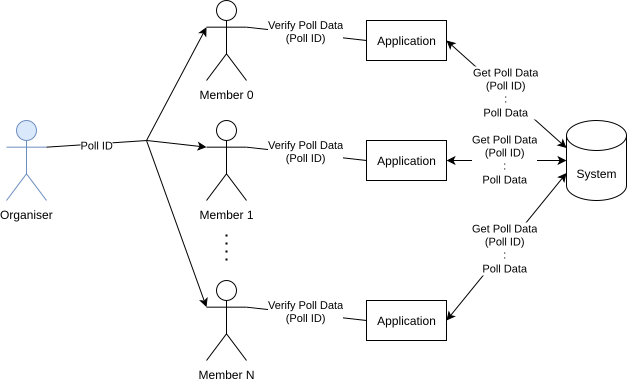
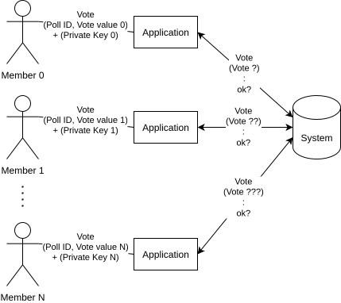
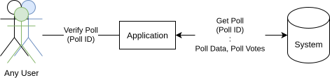

# Projekt

Celem projektu było stworzenie aplikacji i systemu służących do tworzenia głosowań które oferowały by anonimowość i jak najmniejszy brak konieczności zaufania do dowolnej strony. Aplikacja jest interfejsem użytkownika dzięki któremu może on w wygodny sposób korzystać z systemu.

# Elementy Projektu

## Schemat Poglądowy

## Aplikacja

### Tworzenie kluczy publicznych

Użytkownik może tworzyć parę klucza prywatnego i klucza publicznego.

### Tworzenie głosowań

Użytkownik może tworzyć głosowania składające się z:
- Opisu,
- Zbioru kluczy publicznych uczestników.

### Weryfikacja głosowania

Użytkownik może zweryfikować informacje dotyczące danego głosowania identyfikowalnego za pomocą deterministycznego identyfikatora głosowania.

### Oddanie głosów

Użytkownik może stworzyć i oddać głos na dowolną opcję. Głos jest weryfikowany i rejestrowany przez ***System***.

Z głosu wynika:
- ***Identyfikator głosowania (deterministyczny)***
- Opcja - Wartość na jaką użytkownik zagłosował.
- ***Nullifikator*** - Unikalna wartość dla połączenia (**nie jawnego**) uczestnika tego głosowania i ***(deterministycznego) identyfikatora tego głosowania***.
- **Dowód przynależności do głosowania i powiązania informacji powyższych, dzięki któremu można zweryfikować czy głos nie został utworzony w nieuczciwy sposób.**.

### Weryfikacja wyników głosowania

Wyniki każdego głosowania można pobrać z ***Systemu*** i je zweryfikować.

## System

Ze względu na ułatwienie zrozumienia oraz uczenienie systemu taniego w implementacji system ten daję jedynie częściowe (nie pełne) gwarancje braku konieczności zaufania.

### Stworzenie głosowania

Każdy użytkownik może stworzyć głosowanie składające się z:
- Opisu,
- Zbioru kluczy publicznych uczestników.

Każde głosowanie jest ***identyfikowalne w sposób deterministyczny***.

### Zagłosowanie

Każdy użytkownik ma prawo oddać głos dla danego głosowania. Głos ten jest rejestrowany tylko jeśli przejdzie weryfikacje pod kątem kryptografi, będzie odnosił się do zarejestrowanego głosowania dla którego nie będzie istniał zarejestrowany głos o takim samym identyfikatorze co podany głos.

Głos jest identyfikowalny poprzez połączenie ***nullifikatora*** oraz ***(deterministycznego) identyfikatora głosu***.

### Udostępnienie danych

Każdy użytkownik ma prawo odczytać z systemu opis, członków, i wyniki głosowań poprzez ***(deterministyczny) identyfikator głosu***.

# Wymagania Techniczne

## Kryptografia - Systyem Głosowania

Wykorzystywny system powinien umożliwiać:
- Tworzenie par kluczy prywatnych i publicznych.
- Tworzenie zbioru kluczy publicznych reprezentujących uczestników głosowania.
- Tworzenie głosu dowodzącego że głos pochodzi od jednego z twórcy klucza publicznego wykorzystanego w danym zbiorze kluczy publicznych. Jednocześnie głos musi wiązać opcję na jaką owy głosujący głosuje, opis głosowania, oraz jedyny możliwy nullifikator jaki może głosujący wygenerować. Nullifikator powinien być stały i nie zmienny dla danego głosującego i opisu głosowania (Nie powinien zależeć od oddanego głosu).
    - Głos powinien być weryfikowalny przez dowolną stronę dla danego opisu głosowania i zbioru kluczy publicznych. 

## Kryptografia - Deterministyczny Identyfikator Głosowań

Każde głosowanie powinno być identyfikowalne krótkim skrótem. Skrót ten powinien wiązać opis i członków głosowania co gwarantowało by nie podrabialność głosowania.

# Działanie

## Aktorzy

- ***Uczestnicy*** - Użytkownicy którzy są właścicielami swoich kluczy publicznych oraz głosującymy w anonimowym głosowaniu.
- ***Organizator*** - Użytkownik który tworzy głosowanie ze zbioru kluczy publicznych jakie otrzymał od uczestników.

## Scenariusz

1. ***Uczestnicy*** tworzą i zapamiętują swoje pary kluczy publicznych i prywatnych. 
    
    
2. ***Uczestnicy*** przekazują organizatorowi swoje klucze publiczne.
    
    
3. ***Organizator*** definiuje z danym opisem i z zbiorem kluczy publicznych jakie otrzymał od uczestników.
4. ***Organizator*** tworzy głosowania i otrzymuje adres głosowania.
    
    
5. ***Organizator*** przekazuje adres głosowania uczestnikom.
6. ***Uczestnicy*** zapoznają się z opisem głosowania wskazanym pod adresem wysłanym przez organizatora.
    
    
7. ***Uczestnicy*** oddają głosy.
    
    
8. Każdy użytkownik jest w stanie ustalić opis i wyniki głosowania wskazanego pod danym adresem.
    
    

# Realizacja

Projekt udało nam się w pełni zrealizować.

<!--

- Aplikacja dla użytkowników w formie strony internetowej. (Hostowana przez Vercel)
- Serwis API w formie zestawu serwisów serverless. (Hostowana przez Vercel)
- Baza danych PostgreSQL. (Hostowana przez NeonDB w ramach serwisu Vercel)

- Tworzenie par kluczy prywatnych i publicznych odbywa się poprzez losowanie klucza prywatnego z przedziału $K_{s} \in \langle{0, p - 1} \rangle {}$ a następnie wyznaczenie klucza publicznego poprzez funkcję hashującą $K_{p} = H_{\text{Poseidon}} \left ( K_s \right)$. Funkcja hashująca Poseidon jest funkcją przystosowaną pod technologie dowodów zerowej wiedzy, lecz możliwe jest zastosowanie innej.
- ...

-->
